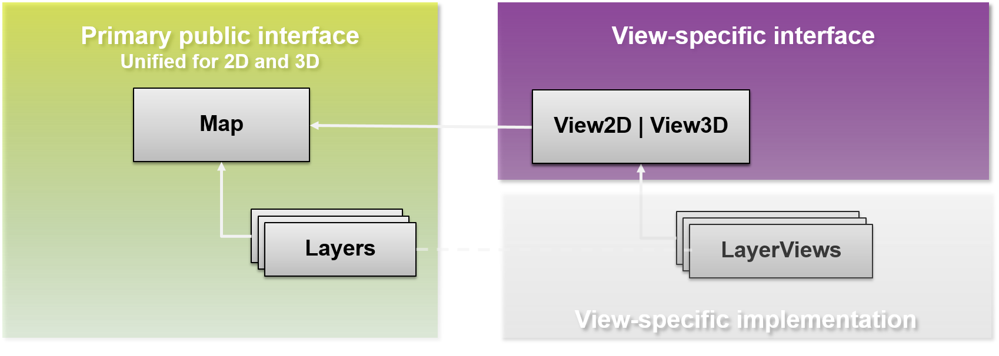

<!-- .slide: data-background="background_title.jpg" -->
#ArcGIS API for Javascript
#Road-ahead
Jeremy Bartley - Yann Cabon


## 3.x
 - [Geometry Engine](http://developers.arcgis.com/javascript/samples/ge_geodesic_buffers/)
 - [Smart Mapping](http://developers.arcgis.com/javascript/samples/smartmapping_bycolor/)
 - [Image Server](http://developers.arcgis.com/javascript/samples/layers_imageservicevector/)
 - [Quantization](demos/quantization/PIXELATE_ALL_THE_POLYGONS.html) vs. [Generalization](demos/quantization/TRIANGULATE_ALL_THE_POLYGONS.html)


## 4.0 - highlights
 - 2D/3D
 - multiple betas during 2015
 - API 4.0: new concepts & changes


## 2D/3D
 - Starting point of 4.0: 3D is coming!
 - currently in [3.x](http://developers.arcgis.com/javascript/samples/map_simple/):
   - Map, many DOM nodes
   - Each Layer, 1 DOM Node
 - Can't work, WebGL renders in one Canvas
 - Solution?


## 2D/3D
 - Separate the business logic from the drawing logic.

 - Communication model by __events__ and __properties watching__
   - clean decoupling
   - clearer about what's going on when something changes 


Experiment - Map running in node


```javascript
// create the map and its layers
var map = new Map({
  basemap: "topo"
});
map.add(new FeatureLayer(...));

// create a 3D view for the Map
var view = new View3D({
  map: map,
  container: "viewDiv"
});
```


## `esri/Accessor`
 - Mixin similar to `dojo/Stateful`
   - single object constructor
   - `get()`, `set()`, `watch()`
 - Difference: watch callback signature is a bit different

     `Stateful`:
```javascript
map.watch('basemap', function(name, oldValue, newValue) {
  // ...
});
```
     `Accessor`:
```javascript
map.watch('basemap', function(newValue, oldValue, name, target) {
  // ...
});
```
 - Difference: no support for setters returning a promise


## Properties watching

 - Direct benefits:
   - remove inconsistancies between constructor, getter, setter functions, events
   - one convention everywhere. _"just need to know what property for a sclass"_
   - Single object constructor, no more 3+ constructors
   - Leaner SDK: we doc only the properties, the rest is convention

 - Changes:
   - no more **_property_**-change events, use `watch()`
   - in 3.x, listen for `extent-change` event.
   - in 4.0 `extent` watchers will be call very often
   - new events for animation. 


## Layers

 - `map.layers`, a collection of the operational layers
   - mix of image AND graphics
 - Shorter names: `TiledLayer`, `DynamicLayer`
 - new ones:
   - `ElevationLayer`
   - `SceneLayer`
   - `GroupLayer`


## GroupLayer

 - New layer: GroupLayer
 - group layers together
 - structure your data visualization
 - visibility mode: `exclusive`, `independent`, `inherit`
 - listMode: `hide-children`, `hidden`
 - [demo](demos/grouplayer/groupLayer.html)


## Collection

 - More or less like an Array
 - `add` / `remove` / `forEach` / `map` / `find` / `findIndex`...
 - emit "change" events when something is added/removed/moved
 - used for layers, used for layers in Basemap, used for graphics


## Basemap

- full fledge class `esri/Basemap`
- basemap's layers are not part of the `map.layers`, but from `map.basemap`
- contains 3 Collections: baseLayers, referenceLayers, elevationLayers
- can be set with
  - [string for esri's basemap](demos/basemap/basemap2d.html)
  - or custom [Basemap instance](demos/basemap/basemap2d-custom.html)
  - in 2D and [3D](demos/basemap/basemap3d.html)


## Basemap

 - `basemap` as a string, creation of the appropriated Basemap instance

  ```javascript
  var map = new Map({
    basemap: 'topo'
  });

  map.set('basemap', 'streets');
  ```

 - `basemap` as an instance of `Basemap`

  ```javascript
  var map = new Map({/*...*/});

  var toner = new Basemap({
    baseLayers: [
      new WebTiledLayer({
        urlTemplate
      })
    ]
  })

  map.set('basemap', toner);
  ```


## 2D
 - new "engine" in the work.
 - faster, more future proof
   - abstraction to draw tiles and dynamic images to ease custom layers/layerviews
   - abstraction to draw in DOM or Canvas, possibly webgl ;-)
 - display graphics while zooming.
 - [viewpadding](demos/view2d/view-padding.html)
 - [continous zoom](demos/view2d/resize-extent.html)
 - rotation


## 3D
 - webgl engine to display the earth.
 - [z/m support](http://maps.esri.com/rc/sat/index.html) in the API, tasks, layers...
 - support for simple symbols
 - new 3D Symbols


## Animation
 - generic functions like `animateTo(target, options):Promise`
 - `esri/Viewpoint`: common way to share between 2D/3D


### Webmap & Webscene APIs
 - read
 - save
 - save as


## Other
 - legacy dojo loader removed - AMD only
 - classes will be properly cased: esri/Map, esri/Graphic, esri/layers/Layer
 - Simplifying Popup


## Conclusion
 - One API
 - 3D, and better 2D
 - simplified API


<!-- .slide: data-background="background_title.jpg" -->
# Questions


<!-- .slide: data-background="background_title.jpg" -->
# Rate This Session
[www.esri.com/RateMyDevSummitSession](www.esri.com/RateMyDevSummitSession)
